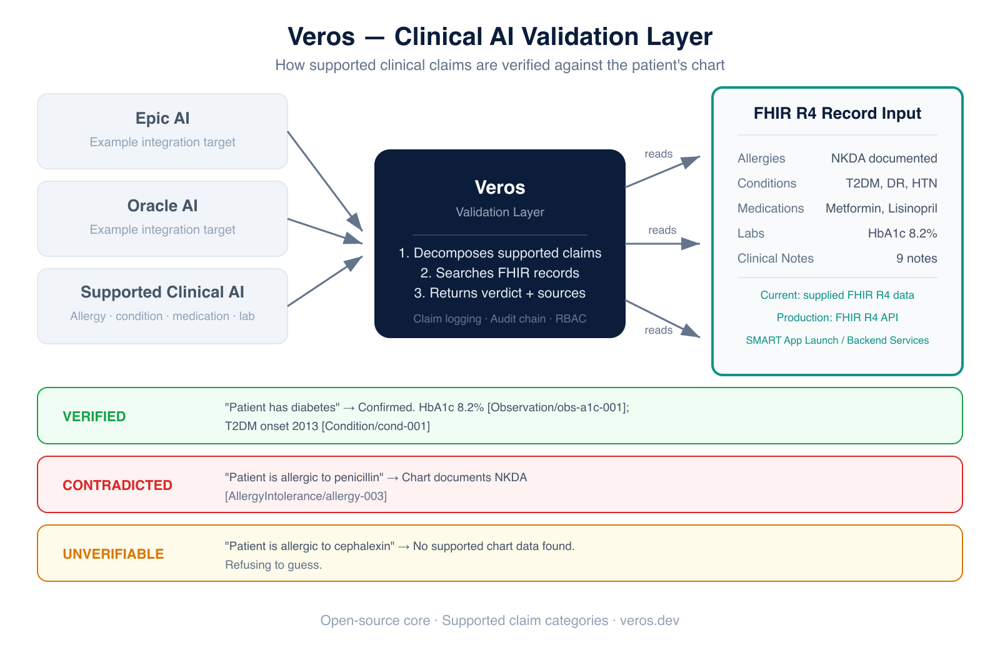

<p align="center">
  
</p>

<p align="center">
  <strong>Every AI system that touches clinical data makes mistakes.<br>Veros catches them before they reach a patient.</strong>
</p>

---

Plug it into any FHIR-compatible EHR. Every AI-generated clinical claim gets fact-checked against the actual patient chart — with citations, audit logs, and role-based access controls. If the chart doesn't back it up, Veros calls it out.

### The problem

LLMs are showing up in every EHR. Epic, Oracle, and a dozen startups are embedding AI that writes clinical notes, suggests diagnoses, and summarizes charts. These models hallucinate. In a clinical setting, a hallucinated allergy or a fabricated lab value isn't a typo — it's dangerous. And right now, no one is checking whether these claims are actually true for the specific patient.

### What Veros does

Veros is a validation layer that sits between any AI system and the patient's FHIR record. You submit a claim. It opens the chart. It tells you whether the record backs it up, contradicts it, or has no data either way.

| Verdict | What it means |
|---|---|
| **VERIFIED** | The chart confirms this. Here's the exact FHIR source. |
| **CONTRADICTED** | The chart says the opposite. Here's the conflicting record. |
| **UNVERIFIABLE** | No data either way. Refusing to guess. |

### How it works

<p align="center">
  
</p>

1. **Any AI system** makes a claim about a patient (e.g., "Patient is allergic to penicillin")
2. **Veros decomposes** the claim into atomic propositions and searches the FHIR chart for each one
3. **Returns a verdict** — verified, contradicted, or unverifiable — with the exact source record cited

### The product

Three modes, one API:

| Mode | What you do | What you get |
|---|---|---|
| **Query** | Ask anything about a patient in plain English | Cited answers from the chart |
| **Differential** | Describe symptoms | Ranked differential with evidence, suggested tests, questions to ask |
| **Verify** | Submit an AI-generated claim | VERIFIED / CONTRADICTED / UNVERIFIABLE with FHIR citations |

### FHIR-native. EHR-agnostic.

Veros speaks FHIR R4 and authenticates via SMART on FHIR. It doesn't replace your EHR — it sits alongside it. Works with Epic, Oracle, Medplum, OpenEMR, OpenMRS, or anything with a FHIR API.

### Built for production

- **Audit trail** — every query, every verification, every access is logged in a hash-chained tamper-evident log
- **RBAC** — 9 clinical roles with per-resource access controls. Admin can't see allergies. Patients can only see their own data.
- **Deidentification** — FHIR-path aware PHI redaction and crypto-hashing for research exports
- **LLM-powered** — any natural language question works. Falls back to deterministic rules when offline.

### Quick start

```bash
git clone https://github.com/KryptosAI/veros.git
cd veros
npm install
npm start          # → http://localhost:3100
npm run eval       # 27 unit tests
```

To enable natural language understanding (otherwise uses deterministic regex):

```bash
export DEEPSEEK_API_KEY="sk-your-key"
# or
export OPENAI_API_KEY="sk-your-key"
npm start
```

### License

Open core. The verification engine, citation system, audit logging, RBAC, and FHIR layer are open source under MIT.

---

*Inspired by Stanford's VeriFact (NEJM AI, 2025). Built independently.*
